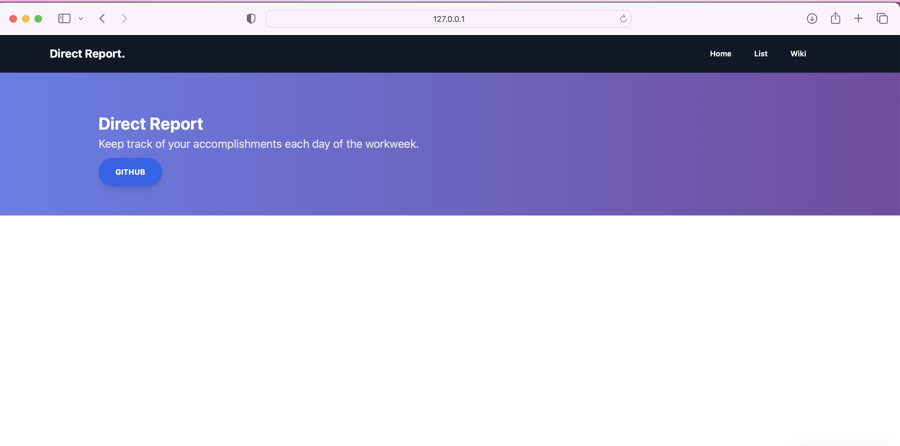
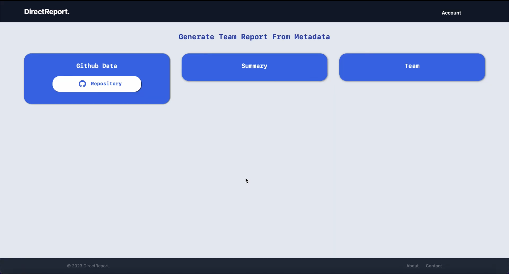
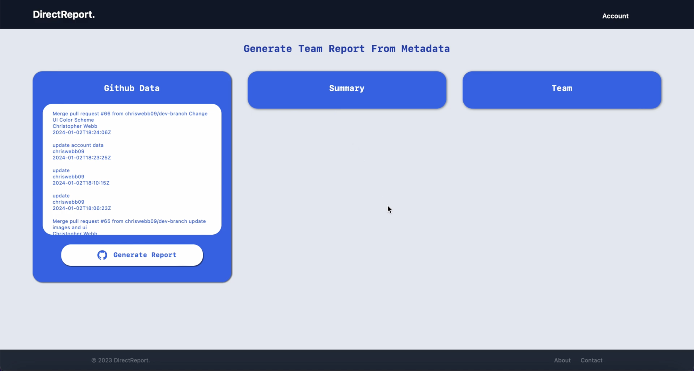

# DirectReport


[](https://raw.githubusercontent.com/chriswebb09/DirectReport/main/LICENSE)
[](https://github.com/chriswebb09/DirectReport/issues)
[](https://app.codecov.io/gh/chriswebb09/DirectReport)
[](https://github.com/chriswebb09/DirectReport/actions?query=workflow%3A%22Build+Status%22)
[](https://github.com/chriswebb09/DirectReport/releases/latest)
[](https://readthedocs.org/projects/directreport/)
[](https://badge.fury.io/py/DirectReport)


# Overview

Keep track of your accomplishments each day of the workweek, create a report of things you accomplished at the end of the week that you can email to manager.  Review progress each quarterly for more effective performance review.

## Project End Goals 

Ultimately the goal of this project goal is seamlessly track your work during the week through API integrations / commandline interface and then allow you to explore the data in a webbrowser page. The end goal is to allow you to maintain notes of your weekly work and if needed generate a concise report for your manager. 

## Documentation 

You can find further documentation at this [Github Page](https://chriswebb09.github.io/DirectReport/)

## Installing

### From Package Manager 

Using pip: 
`pip install DirectReport`

### From Project Files: 

This project uses a `Makefile` as a command registry, with the following commands:
- `make`: list available commands
- `make develop`: install and build this library and its dependencies using `pip`
- `make build`: build the library using `setuptools`
- `make lint`: perform static analysis of this library with `flake8` and `black`
- `make format`: autoformat this library using `black`
- `make annotate`: run type checking using `mypy`
- `make test`: run automated tests with `pytest`
- `make coverage`: run automated tests with `pytest` and collect coverage information
- `make dist`: package library for distribution

Adapted From: https://github.com/ColumbiaOSS/example-project-python

## Running Direct Report

### Overview

```

Usage: python -m DirectReport [OPTIONS] COMMAND [ARGS]...

Options:
  --help  Show this message and exit.

Commands:
  launch
  new
  show-list
  
```

### Launch

```

$ python DirectReport launch

```

### Show-List


#### Basic

```

 $ python DirectReport list
 
```


#### All

```

$ python DirectReport list --all

 ```
 
#### Daily
 
 ```
 
$ python DirectReport list --day

```

#### Weekly

```

$ python DirectReport list --week

```

## Web Interface

### Home

Web interface home page - WIP



### List

Web interface for list page - WIP



### Detail


