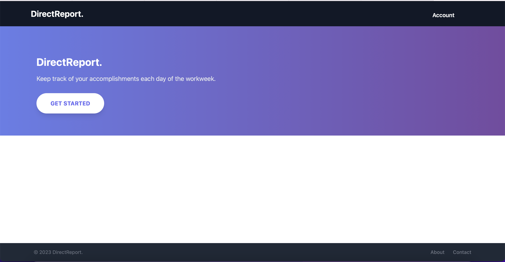
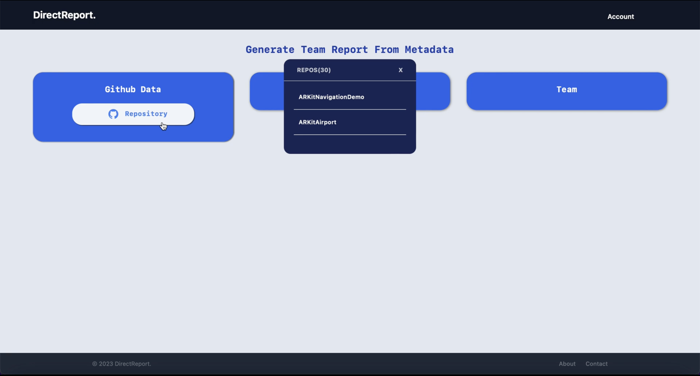

# DirectReport


[](https://raw.githubusercontent.com/chriswebb09/DirectReport/main/LICENSE)
[](https://github.com/chriswebb09/DirectReport/issues)
[](https://app.codecov.io/gh/chriswebb09/DirectReport)
[](https://github.com/chriswebb09/DirectReport/actions?query=workflow%3A%22Build+Status%22)
[](https://github.com/chriswebb09/DirectReport/releases/latest)
[](https://readthedocs.org/projects/directreport/)
[](https://badge.fury.io/py/DirectReport)


# Overview

Keep track of your accomplishments each day of the workweek, create a report of things you accomplished at the end of the week that you can email to manager.  Review progress each quarterly for more effective performance review.

## Project End Goals 

Ultimately the goal of this project goal is seamlessly track your work during the week through API integrations / commandline interface and then allow you to explore the data in a webbrowser page. The end goal is to allow you to maintain notes of your weekly work and if needed generate a concise report for your manager. 

## Documentation 

You can find further documentation at this [Github Page](https://chriswebb09.github.io/DirectReport/)

## Installing

### From Package Manager 

Using pip: 
`pip install DirectReport`

### From Project Files: 

This project uses a `Makefile` as a command registry, with the following commands:
- `make`: list available commands
- `make develop`: install and build this library and its dependencies using `pip`
- `make build`: build the library using `setuptools`
- `make lint`: perform static analysis of this library with `flake8` and `black`
- `make format`: autoformat this library using `black`
- `make annotate`: run type checking using `mypy`
- `make test`: run automated tests with `pytest`
- `make coverage`: run automated tests with `pytest` and collect coverage information
- `make dist`: package library for distribution

Adapted From: https://github.com/ColumbiaOSS/example-project-python

## Running Direct Report

### Overview

```

Usage: python -m DirectReport [OPTIONS] COMMAND [ARGS]...

Options:
  --help  Show this message and exit.

Commands:
  delete  Deletes an item with the specified ID.
  launch  Launches the web browser and runs the app.
  list    Lists items based on the selected transformation flag.
  mail    Sends an email with the week's work items.
  new     Adds a new entry to the list.
  
```

### Launch

#### Overview of Launch command options:

```

Usage: python -m DirectReport launch [OPTIONS]

  Launches the web browser and runs the app.

  :param url: The URL to open in the web browser.

Options:
  --url TEXT  URL to open in the web browser
  --help      Show this message and exit.
  
```

#### Using the launch command: 

```

$ python DirectReport launch
 * Serving Flask app 'DirectReport.browserview.app'
 * Debug mode: off
 WARNING: This is a development server. Do not use it in a production deployment. 
 Use a production WSGI server instead.
 * Running on http://127.0.0.1:5000
 Press CTRL+C to quit
 127.0.0.1 - - [12/May/2023 15:23:25] "GET / HTTP/1.1" 200 -


## Web Interface





